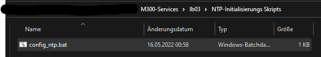
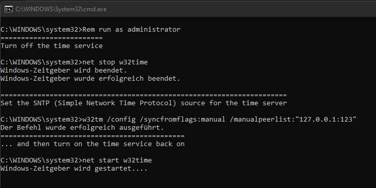
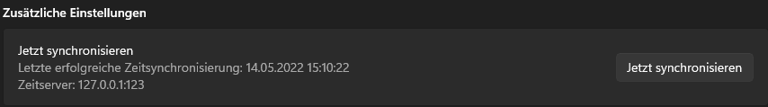

# **Inhaltsverzeichis**
- [**Inhaltsverzeichis**](#inhaltsverzeichis)
- [**Einleitung**](#einleitung)
- [**Einrichten des Service nach der Container Initialisierung**](#einrichten-des-service-nach-der-container-initialisierung)
  - [Beispiel, wie es aussieht:](#beispiel-wie-es-aussieht)
- [**Code Erklärung**](#code-erklärung)
  - [**Repository Struktur**](#repository-struktur)
- [**Funktion der einzelnen Files**](#funktion-der-einzelnen-files)
  - [Dockerfile](#dockerfile)
  - [docker-compose.yml](#docker-composeyml)
  - ['vars' Datei](#vars-datei)
  - [Die Shell Skripts](#die-shell-skripts)
    - [*Schnelle Erklärung der Skripts*](#schnelle-erklärung-der-skripts)
  - [- Offline Skript im Falle das keine Internetverbindung besteht mit allen Informationen.](#--offline-skript-im-falle-das-keine-internetverbindung-besteht-mit-allen-informationen)
  
# **Einleitung**
In meiner LB03 geht es um die Erstellung eines NTP Zeit Server Dienstes innehralb eines Containers welcher genutzt werden kann um eine sekundäre Quelle für die Real-Time zu haben. Dieser Service ist eine relativ simple Anwendung welche jedoch bei Problemen mit primär Zeitservern hilfreich sein kann um so eine Zweitquelle zu haben.

Das Einrichten des Services dringt auf Systemeinstellungen und Eigenschaften zu so wird ein separates Skript beigegeben um eine sichere Einbindung des NTP Services in Windows zu gewährleisten. Dieses Skript kommt in Batch Form und kann einfach in meiner GIT Repository unter dem Verzeichnis ```├─ NTP-Initialiserungs Skripts/ ``` unter den Namen ```config_ntp.bat ``` gefunden werden. 

Der Service wird beim ausführen des ```docker-compose up ``` Befehl automatisch konfiguriert und vorbereitet. Dazu wird im Hintergrund ein Archlinux Container aufgesetzt auf welchem der sogenannte **Chrony** Dienst eingerichtet wird. 

**Chrony** ist ein Open-Source Tool zur Beziehung von der *Real-Time* durch selbst-definierten NTP Servern. Dazu könne zum Beispiel die Dienste von [Google](https://developers.google.com/time), [Cloudflare](https://www.cloudflare.com/time/) oder [CH-Pool](https://www.pool.ntp.org/zone/ch) verwendet werden. 

In meinem Service verwende ich Cloudflare da ich von Erfahrung her mir von der zuverlässigen Funktionalität der Server sicher bin. 

# **Einrichten des Service nach der Container Initialisierung**
Um nun nach dem Starten des Containers und des NTP Dienstes, diese zu verwenden muss man das von mir beigelegte Skript verwenden. 

**WICHTIG - Skript muss als Administrator ausgeführt werden!**

Das Skript findet man am folgendem Ort:
```
   ├─lb03  
     ├─ NTP-Initialiserungs Skripts/
        ├─ config_ntp.bat (Für Windows)
```
Das Skript löst die Umkonfiguration des Zeitservers aus und setzt es auf die *127.0.0.1:123* Adresse welche zum Dienst des Containers sendet und von diesem dann die Zeitinformationen erhält.

## Beispiel, wie es aussieht:
- Die ```config_ntp.bat``` aufsuchen.



- Als Administrator ausführen!


- Windows setzt nun den NTP Container zum neuen Zeitserver



- Der Zeitserver ist nun auf den Container gesetzt! (Siehe *Zeitserver: 127.0.0.1:123*)



Wie man sieht ist das Einrichten des Dienstes sehr einfach gestaltet und verursacht keinerlei Probleme.
# **Code Erklärung**
Die Funktionen der Code Dateien werden in folgendem Abschnitt genauer unter die Lupe genommen.


## **Repository Struktur**
Die Struktur des M300-Services/lb03 Repositories sieht folgendermassen aus:
```
M300-Services/ 
  ├─ lb03/
     ├─ README.md
     ├─ run.sh
     ├─ Dockerfile
     ├─ docker-compose.yml
     ├─ build.sh
     ├─ build-multiarch.sh
     ├─ vars 
     ├─ assets/
        ├─ startup.sh
     ├─ NTP-Initialiserungs Skripts/
        ├─ config_ntp.bat (Für Windows)
```
**Die wichtigsten Dateien hier sind:**
- Dockerfile
- build.sh
- docker-compose.yml
- build-multiarch.sh
- vars
- run.sh

# **Funktion der einzelnen Files**

## Dockerfile

Die Dockerfile besitzt alle Informationen zum Aufbau des Containers. Sie ist sozusagen der Bauplan der gesamten Container Grundstruktur und wird für jede Erstellung eines Containers gebraucht.

*Der Aufbau:*
```
FROM alpine:latest

ARG BUILD_DATE

# Container Informationen
LABEL build_info="cturra/docker-ntp build-date:- ${BUILD_DATE}"
LABEL maintainer="Chris Turra <cturra@gmail.com>"
LABEL documentation="https://github.com/cturra/docker-ntp"

# Chrony Installation
RUN apk add --no-cache chrony

# Konfigurations Skript einbinden
COPY assets/startup.sh /opt/startup.sh

# NTP Port
EXPOSE 123/udp

# Docker Gesunheitscheck durchführen
HEALTHCHECK CMD chronyc tracking || exit 1

# Chrony starten
ENTRYPOINT [ "/bin/sh", "/opt/startup.sh" ]
```
- FROM 
  -  Gibt das Basis-Bild an. Die Alpine-Version ist das minimale Docker-Image, das auf Alpine Linux basiert und nur 5 MB groß ist.
- RUN
  - Führt einen Linux-Befehl aus. Wird verwendet, um Pakete im Container zu installieren, Ordner zu erstellen usw.
- LABEL
  - Stellt Metadaten bereit.
- COPY
  - Kopiert Dateien und Verzeichnisse in den Container.
- EXPOSE
  - Ports freigeben.
- ENTRYPOINT
  - Stellt Befehle und Argumente für einen ausführenden Container bereit.
- HEALTHCHECK
  - Hier geht es darum, den Zustand von Docker-Containern zu überprüfen. 

----

## docker-compose.yml
Die docker-compose Datei ist für den gleichnamigen Befehl zuständig um automatisch einzelne oder gleich mehrere Container auf einmal zu kreieren. In meinem Auftrag wird nur ein einzelner Container benötigt.

```
version: '3.4'

services:
  ntp:
    build: .
    image: cturra/ntp:latest
    container_name: ntp
    restart: always
    ports:
      - 123:123/udp
    read_only: true
    tmpfs:
      - /etc/chrony:rw,mode=1750
      - /run/chrony:rw,mode=1750
      - /var/lib/chrony:rw,mode=1750
    environment:
      - NTP_SERVERS=time.cloudflare.com
      - LOG_LEVEL=0

```
*Erklärung zu Docker-Compose:* https://docs.docker.com/compose/

---

## 'vars' Datei

Die **vars** Datei dient für die einfache und einheitliche Definierung von Variablen im gesamten Projekt. Diese Datei dient sozusagen als Bibliothek für alle benötigten Variablen der Initalisierungs Skripts (.sh Skripte). 

Wird eine Variable hinzugefügt oder muss geändert werden so kann man dies in dieser Datei tun. In den Shell Skripts werden die Variablen dann mithilfe Einbindung der **vars** Datei und dem Ablesen mit den {} Klammern, abgerufen.

```
IMAGE_NAME="cturra/ntp"
CONTAINER_NAME="ntp"
NTP_SERVERS="time.cloudflare.com"
LOG_LEVEL=0

DOCKER_OPTS=""
```
----
## Die Shell Skripts
```
  ├─ lb03
     ├─ run.sh
     ├─ build.sh
     ├─ build-multiarch.sh
     ├─ assets/
        ├─ startup.sh
```
Die SHELL Skripts besitzen alle integralen Code für die korrekte Initialiserung des Containers. Dazu gehören Sachen wie die Definition der NTP Server, das Starten der verschiedenen Dienste und auch das überprüfen ob all dies korrekt durchlief.

Zu diesen muss nicht viel erklärt werden da Sie nicht zum Thema Container komplett gehören sondern für die korrekte Ausführung der Dienste da sind. 

### *Schnelle Erklärung der Skripts*
- run.sh 
  - Überprüft ob gleichnamige Container bereits existieren und warnt den Nutzer in diesem Fall. Wenn dies nicht der Fall wäre führt das Skript den weiteren Prozess der Container Erstellung durch, wie das Benennen und Eigenschaften setzen des Containers.
- build.sh
  - Eigenschaften für die Umgebung des Containers setzen. 
- buil-multiarch.sh
  - Ausführliche Version des obigen Skriptes.
- startup.sh
  - Offline Skript im Falle das keine Internetverbindung besteht mit allen Informationen.
---

Author: Vincent Holgado